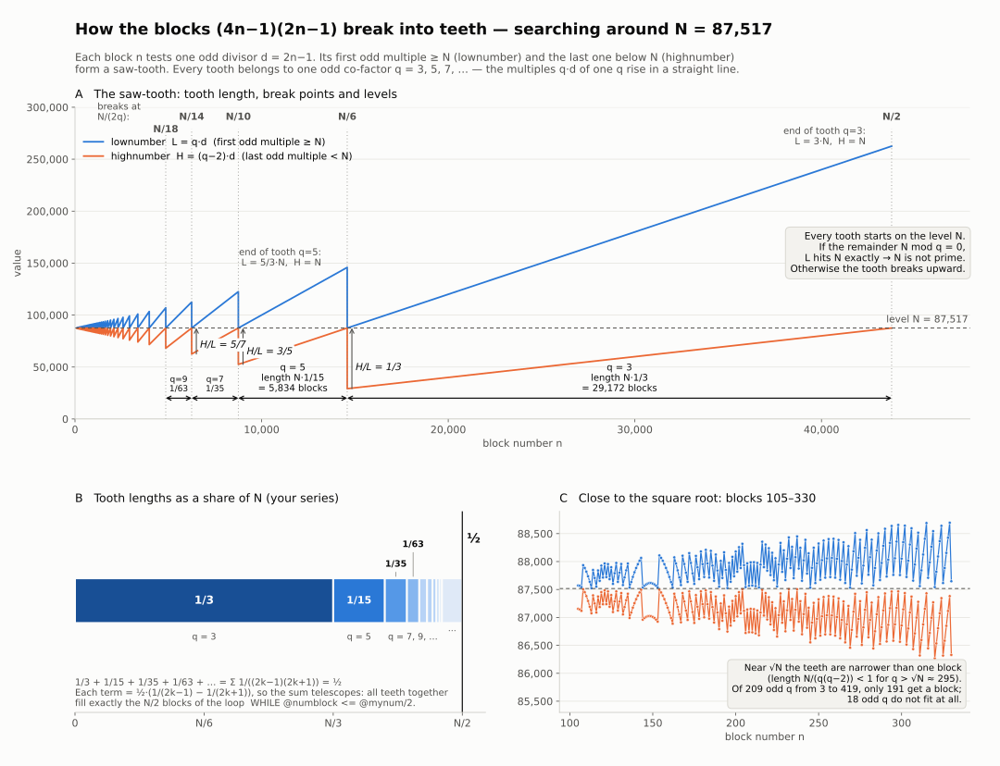
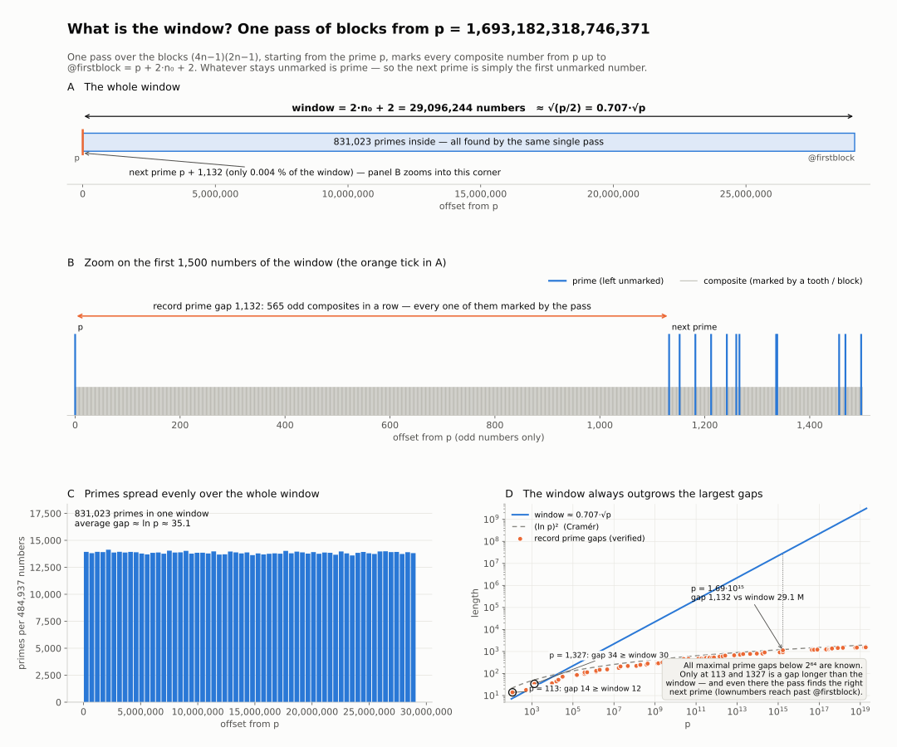
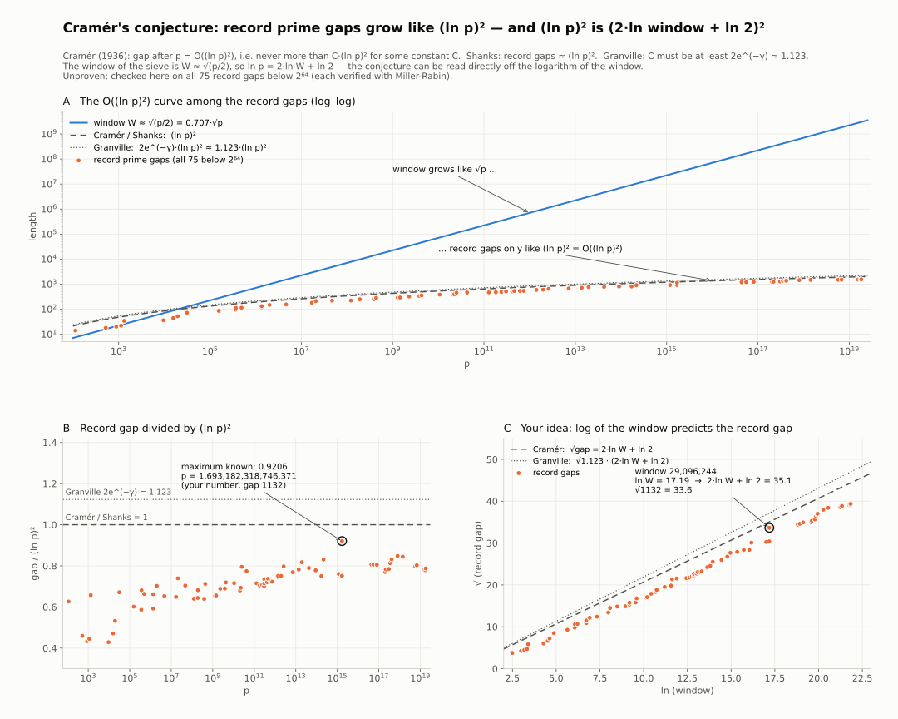

# Block sieve (4n − 1)(2n − 1)

A prime sieve built on the blocks **(4n − 1)(2n − 1)**, originally written by Dominika
as a T-SQL stored procedure (`dbo.prime_search`, `dbo.prime_search2`, 2024) and ported
to Python (`primes-sieve-bydomi.py`, 2026) with a compiled Numba kernel [18].

Starting from a prime `p`, **one pass over the blocks marks every composite number in a
window above `p`**. Whatever stays unmarked is prime. The next prime is the first unmarked
number, and the whole window yields all primes in it at once.

At `p ≈ 1.7·10¹⁵` one pass takes about 1 second and returns ~830,000 primes
(**≈ 1.2 µs per prime**).

> [!NOTE]
> **The next prime is computed from the prime `p` alone.**
>
> - The only input is `p`: no table of small primes, no primality test and no state from earlier
>   runs are used. (A classic segmented sieve [15] first computes the sieving primes up to `√(p + W)`;
>   `next_prime` functions test candidates one by one with a primality test [10][11].)
> - One pass over a window of `~0.707·√p` marks every composite in it, so it gives the next prime and
>   all other primes of the window. Checked for all record prime gaps below `2⁶⁴` (see [section 5](#5-the-window-and-prime-gaps)).
> - The factors are taken in reverse order (the larger factor `d` goes up from `√(p/2)`, the co-factor
>   `q` goes down to 3), and arithmetic progressions (the *teeth*) are detected so that the sieve can
>   jump from one tooth to the next.
> - A sieve over all odd divisors up to `√(p + W)` also needs no table of primes and takes fewer steps
>   (`½·√p` instead of `~1.68·√p`, variant B in [section 10](#10-limits-and-possible-improvements)).

---

## Contents

1. [How it works](#1-how-it-works)
2. [The algorithm as equations](#2-the-algorithm-as-equations)
3. [The teeth](#3-the-teeth)
4. [How many blocks: the constant 1.678](#4-how-many-blocks-the-constant-1678)
5. [The window and prime gaps](#5-the-window-and-prime-gaps)
6. [How many primes are in a window](#6-how-many-primes-are-in-a-window)
7. [Usage](#7-usage)
8. [Performance and comparison with Miller-Rabin](#8-performance-and-comparison-with-miller-rabin)
9. [Verification](#9-verification)
10. [Limits and possible improvements](#10-limits-and-possible-improvements)
11. [References](#references)

---

## 1. How it works

Block `n` stands for one odd divisor

```
d = 2n − 1
```

For the number `N` being examined (the current prime), each block computes:

- **lownumber** `L`: the first odd multiple of `d` that is ≥ `N`
- **highnumber** `H`: the last odd multiple of `d` below `N`

All `L` values are stored in the table `@a` (composite numbers). When three blocks in a row
give an arithmetic progression, the sieve recognises a *tooth* (see [section 3](#3-the-teeth)):

- it fills the rest of that progression up to the end of the window,
- and it **jumps** straight to the next tooth, skipping all blocks in between.

After the loop, the multiples of 6 above the last `L` are filled in. The first odd number
above `N` that is not in `@a` is the next prime.



---

## 2. The algorithm as equations

Notation: `N = @mynum`, `n = @numblock`, `d = 2n − 1`.

**Blocks**

```
block(n)    = 4n − 2 = 2d
maxblock(n) = (4n − 1)(2n − 1) = d·(2d + 1)
```

`2d + 1` is always odd, so `maxblock − k·block = d·(2d + 1 − 2k)` are always **odd multiples
of d**. This is the one property the block shape must have (see [section 10](#10-limits-and-possible-improvements)).

**Starting block** (the SQL loop `WHILE @maxblock < @mynum`, solved directly):

```
n₀ = ⌈(3 + √(8N + 1)) / 8⌉        d₀ = 2n₀ − 1 ≈ √(N/2)
```

**Window**

```
@firstblock = F = N + 2n₀ + 2      width W = 2n₀ + 2 ≈ √(N/2) = 0.707·√N
```

**lownumber and highnumber**

```
L(n) = d·q,   q = smallest odd number ≥ N/d
H(n) = L(n) − 2d = d·(q − 2)
```

This follows from `maxblock − ⌊(maxblock − N)/block⌋·block`. It also shows three facts:

- `@highnumber <= @firstblock` is always true, because `H < N ≤ F`. So every `L` goes into `@a`.
- `@stop` happens exactly when `N = L`, i.e. when `d` divides `N`.
- `@attention` increases exactly when `H = d`, i.e. `q = 3`, i.e. `d ≥ N/3`.

**Progression and jump.** If three visited blocks give `L₁, L₂, L₃` with `L₃ − L₂ = L₂ − L₁ = Δ`:

```
fill:  L₃ + k·Δ   for k = 1, 2, …  while < F
jump:  s = ⌈N / (|Δ| − 4)⌉ ;  if s − n > 5  continue from block s
```

**Result of one pass**

```
M(N) = { q·d :  d, q odd,  d ≥ d₀,  q ≥ 3,  N ≤ q·d < F }  ∪  { multiples of 6 filled at the end }
```

These are the odd composite numbers in `[N, F)`. Every odd composite `x` has a divisor
`≥ √x ≥ d₀`, so `M(N)` contains all of them.

**Next prime**

```
N' = N + 2·min{ k ≥ 1 : N + 2k ∉ @a }
```

---

## 3. The teeth

For a fixed odd co-factor `q`, the lownumbers `L = q·d` rise in a straight line over
all blocks with

```
N/q ≤ d < N/(q − 2)
```

Plotted over `n`, this gives a saw-tooth. Each tooth belongs to one odd `q = 3, 5, 7, …`.

| property | formula | values for q = 3, 5, 7, 9, … |
|---|---|---|
| tooth breaks at block | `n = N/(2q)` | N/6, N/10, N/14, N/18 … |
| tooth length (blocks) | `N / (q(q − 2))` | N·1/3, N·1/15, N·1/35, N·1/63 … |
| level at the start of a tooth | `H/L = (q − 2)/q` | 1/3, 3/5, 5/7, 7/9 … |
| end of a tooth | `L = q/(q − 2)·N`, `H = N` | 3N, 5N/3, 7N/5 … |

The tooth lengths add up exactly to the loop range `@numblock <= @mynum/2`:

```
1/3 + 1/15 + 1/35 + 1/63 + … = Σ 1/((2k − 1)(2k + 1)) = ½
```

because every term is `½·(1/(2k − 1) − 1/(2k + 1))`, so the sum telescopes.

Every tooth starts on the level `N`. If `N mod q = 0`, `L` hits `N` exactly and `N` is composite.
Otherwise the tooth breaks upward.

**What a jump does.** Inside a tooth `Δ = 2q`, so the jump target `⌈N/(2q − 4)⌉` is exactly the
start of the next tooth `q − 2`. The sieve recognises the current `q` from three points,
fills the rest of the tooth into the window and jumps to the next one.

Near `√N` the teeth are narrower than one block (`N/(q(q − 2)) < 1` for `q > √N`), so not every
odd `q` gets a block. For `N = 87,517`: of 209 odd `q` from 3 to 419 only 191 get a block.

**Relation to Eratosthenes.** The procedure is a segmented sieve [15] over the window with the order
of divisors reversed. Eratosthenes crosses out multiples of small primes `q = 2, 3, 5, …` upward.
This sieve walks the larger factor `d` upward from `√(N/2)`, so the smaller factor
`q = N/d` goes down to 3. The teeth let it discover each `q` without knowing it in advance.

---

## 4. How many blocks: the constant 1.678

One pass visits about **1.678·√N blocks**, at every size:

| N | blocks visited | ratio to √N |
|---|---|---|
| 10⁸ | 16,700 | 1.670 |
| 10¹² | 1,676,853 | 1.677 |
| 10¹⁵ | 53,047,366 | 1.678 |

Without jumps the loop would run to `N/2`. At `10¹²` the jumps save a factor of ~300,000.

The constant is not a mathematical constant. It comes from three parameters of the script:

```
1.678 ≈  −0.354            start at d₀ = √(N/2)            (−1/(2√2))
         +1.016            blocks walked one by one until teeth are ≥ ~7.5 blocks wide
         +0.661            ~0.18·√N teeth × ~3.7 blocks per tooth (3 to detect + landing)

approximately   c ≈ √w/2 − 1/(2√2) + k/(2√w),   w ≈ 7.5,  k ≈ 3.7
```

`w ≈ 7.5` comes from the jump condition `IF CEILING(...) - @numblock > 5`. Changing that threshold
changes the constant:

| jump threshold | > 1 | > 2 | > 3 | **> 5** | > 10 | > 20 |
|---|---|---|---|---|---|---|
| blocks | 1.517·√N | 1.544·√N | 1.583·√N | **1.678·√N** | 1.934·√N | 2.409·√N |

With the SQL rounding of `@diffnum NUMERIC(37,1)` the count is about 6 % lower (≈ 1.57·√N).
For `N = 87,517` the SQL procedure makes 467 passes: 934 rows in `resulttab`, 430 "lowest"
and 504 "highest". The difference of 37 comes from `NUMERIC(37,1)` rounding a quotient such
as 12.96 up to 13.0.

---

## 5. The window and prime gaps



One pass from `p = 1,693,182,318,746,371`:

| | value |
|---|---|
| starting block n₀ | 14,548,121 |
| window W = 2n₀ + 2 | 29,096,244 numbers (≈ 0.707·√p) |
| blocks visited | 69,029,826 |
| primes in the window | 831,023 |
| next prime | p + 1,132 (a record prime gap, 0.004 % of the window) |

**Why the next prime is always inside the window.** The window grows like `√p`, while prime gaps
grow only like `(ln p)²` (Cramér's conjecture [1]). At `10¹⁵` the window has 22 million numbers, while the
largest known gap below `2⁶⁴ ≈ 1.8·10¹⁹` is 1,550 [7][8][9].

Tests with an empty `@a`, one pass per prime:

- all 216,811 primes from 11 to 3,000,000 → next prime correct every time
- all record (maximal) prime gaps up to `1.69·10¹⁵` → correct (e.g. gap 1,132 after `1,693,182,318,746,371`)
- windows in which the starting block changes (`p` just below `(4n₀−1)(2n₀−1)`) → correct

Only at `p = 113` (gap 14 > window 12) and `p = 1327` (gap 34 > window 30) is a gap longer than the
window. Even there the pass finds the right next prime, because lownumbers reach past
`@firstblock`. From about 1,400 upward the window is always many times longer than any known gap.
For numbers below `2⁶⁴` all maximal gaps are known [8][9], so the method is guaranteed there. For arbitrarily
large numbers it is not proven: it needs every gap to be shorter than ~0.707·√p.

### Cramér's conjecture read off the window



Because `W ≈ √(p/2)`:

```
ln p = 2·ln W + ln 2          (ln p)² = (2·ln W + ln 2)²
```

Cramér's conjecture `gap = O((ln p)²)` [1][2] can therefore be written directly in terms of the window:

```
√gap  ≲  2·ln W + ln 2
```

Plotting `√(record gap)` against `ln(window)` gives a straight line with slope 2 (panel C).

For `p = 1,693,182,318,746,371`: `ln W = 17.19`, `2·ln W + ln 2 = 35.1`, `√1132 = 33.6`. Its ratio
`gap/(ln p)² = 0.9206` is the largest known for all numbers below `2⁶⁴` (the Cramér–Shanks–Granville ratio) [5][6].

**About this prime and gap.** The graph starts from the real prime `1,693,182,318,746,371`. It is followed
by the known maximal prime gap of **1132**, the first *kilogap* (the first known prime gap of 1000 or more),
discovered by Bertil Nyman on 24 January 1999. Its Cramér–Shanks–Granville ratio `gap/(ln p)² ≈ 0.9206`
is still one of the highest ever observed. One pass of the block sieve from this prime finds the gap
correctly: the next prime `1,693,182,318,747,503` is the first unmarked number in the window.
Sources: [5][6].

This is a conjectured order of magnitude, not an exact bound. Granville [3] suggests gaps may occasionally
exceed `(ln p)²` by up to ~1.12×.

**A narrower window.** When only the next prime is needed, a window of `2·(2·ln W + ln 2)²`
(≈ 2,460 numbers at `1.7·10¹⁵` instead of 29 million) gives the same next prime ~33 % faster. The
number of blocks does not depend on the window, only the filling does. As a safeguard, if nothing is
found inside the window, the window is doubled and the pass repeated.

---

## 6. How many primes are in a window

The exact count needs sieving (this pass) or a π(x) algorithm [16]. Estimating it is easy with the
prime number theorem [19]:

```
count ≈ W / ln p ≈ √(p/2) / ln p
```

| p | window W | actual (sieve) | W / ln p | error |
|---|---|---|---|---|
| 1,000,000,000,039 | 707,110 | 25,587 | 25,591 | −0.02 % |
| 99,999,999,999,973 | 7,071,072 | 219,395 | 219,352 | +0.02 % |
| 999,999,999,900,017 | 22,360,684 | 647,277 | 647,408 | −0.02 % |
| 1,693,182,318,746,371 | 29,096,244 | 831,023 | 829,771 | +0.15 % |

Over 300 random windows at `10¹²` (~30,800 primes each), the standard deviation from `W / ln p` was 0.41 %.

If the teeth crossed out independently, the count would be `W·Π(1 − 1/q)` over the primes `q ≤ √F`.
That estimate is 12.3 % too high in every window: the ratio is `2·e^(−γ) = 1.1229`, where
`γ = 0.5772` is the Euler–Mascheroni constant (Mertens' paradox, from Mertens' theorem [20]; see also [3]).

---

## 7. Usage

Requirements: Python 3.9+, `numpy`. `numba` is strongly recommended (`pip install numba`).
`cupy` is optional and gives no real benefit (see [section 10](#10-limits-and-possible-improvements)).

```
python primes-sieve-bydomi.py
```

Settings at the bottom of `primes-sieve-bydomi.py`:

| setting | meaning |
|---|---|
| `MODE = "window"` | one pass returns all primes of the window; the next pass starts from the largest one |
| `MODE = "prime"` | the original way: one pass = one next prime |
| `START` | where to start (in window mode with `MR_CHECK="none"` and in prime mode with `MR=False` it must be prime) |
| `WINDOWS` | number of passes (window mode) |
| `MR_CHECK` | `"none"` / `"sample"` (Miller-Rabin on 1,500 primes per window) / `"all"` |
| `OUTPUT_FILE` | `"auto"` = `primes_<START>.txt` next to the script, or a path, or `None` |
| `RESUME` | if the file exists, continue after its last prime and append |
| `REFERENCE` | path to your own sorted list of primes; compared with the result at the end |
| `COUNT_P`, `MR`, `BACKEND` | prime mode: number of primes, Miller-Rabin on/off, `"auto"` / `"numba"` / `"gpu"` / `"numpy"` / `"python"` |

Output files:

- `primes_<START>.txt`: one prime per line, no header
- `primes_<START>_summary.txt`: the table of windows and the gap/window summary

Example (window mode, 5 windows from `1,693,182,318,746,371`):

```
   #              from prime         window     primes           largest prime  min gap  max gap    MR   time
   1        1693182318746371     29,096,244    831,023        1693182347842613        2     1132    OK   (1.1 s)
   2        1693182347842613     29,096,244    830,004        1693182376938841        2      426    OK   (1.9 s)
   3        1693182376938841     29,096,244    828,988        1693182406035061        2      470    OK   (2.7 s)
   4        1693182406035061     29,096,244    829,894        1693182435131281        2      508    OK   (3.5 s)
   5        1693182435131281     29,096,244    829,936        1693182464227523        2      438    OK   (4.2 s)

Gap and window summary
  primes found   : 4,149,845 in 5 windows, 4.2 s (1.02 µs per prime)
  largest gap    :   1132   after 1693182318746371   (gap / (ln p)^2 = 0.9206)
```

Functions you can call from your own code:

| function | what it does |
|---|---|
| `harvest_window(p)` | one pass from the prime `p`, returns all primes in the window |
| `search_windows(start, windows, …)` | window mode with files, resume and summary |
| `search(start, count_p, …)` | prime mode (one next prime per pass); keeps `s.history` |
| `check_against_list(found, reference)` | compares a result file with your list and prints the differences |
| `compare(start, count_p)` | checks that the fast backend equals the original row-by-row port |
| `is_prime(n)` | deterministic Miller-Rabin [10][11] with the first 13 prime bases (n < 3.3·10²⁴ [12]) |

---

## 8. Performance and comparison with Miller-Rabin

Same place, `p = 1,693,182,318,746,371`:

| method | range | primes | time | per prime |
|---|---|---|---|---|
| Miller-Rabin, every odd number separately | 2,000,000 | 57,322 | 6.3 s | 110 µs |
| block sieve, window mode | 29,096,244 | 831,023 | 1.0 s | **1.2 µs** |

The sieve is ~90× faster per prime found. One pass handles the whole window at once: every tooth
marks its whole progression of multiples in one sweep. Miller-Rabin must test every number
separately, and there are ~17 odd candidates per prime.

To keep the comparison fair:

- The sieve runs compiled (Numba), while the Miller-Rabin above is pure Python. A compiled
  Miller-Rabin (e.g. `gmpy2`) would be ~10–20× faster, so the sieve would lead by ~5–10×.
- For **one** number Miller-Rabin wins clearly: 80 µs against ~0.9 s for a sieve pass. For very large
  numbers (e.g. 10³⁰) a window of `√p` is impossible. Miller-Rabin is the checker, the sieve the generator.
- Variant C below (remainder at the break, prime `q` only) takes ~0.09 s per window at `10¹⁵`,
  about 0.14 µs per prime. Specialised libraries such as *primesieve* [17] are in the same range or faster.

**Development of the speed** (one next prime at `10¹⁵`):

| version | time per prime |
|---|---|
| Python port of the SQL, NumPy (the `"GPU"` setting, which actually ran NumPy) | ~122 s |
| Numba kernel, prime mode | ~0.65 s |
| Numba kernel, window mode | ~0.000001 s (1.2 µs) |

Where the time of one pass goes (`10¹⁵`): 62 % is the chain of blocks and jumps, which is sequential
because every jump depends on the three previous lownumbers. The other 38 % is filling `@a`. Because
the chain cannot be split, a GPU does not help: a single GPU thread is slower than a CPU core.
Independent ranges (each started from a known prime) can run on several CPU cores in parallel.

---

## 9. Verification

- **Ports.** The Numba and NumPy backends give exactly the same primes, warnings and `@a` content as
  the row-by-row port (starts 11, 1327, 76181, 1,000,003, 10⁸, 10¹², 10¹⁴).
- **SQL arithmetic.** An emulation of `NUMERIC(37,1)` and `CEILING` reproduces the SQL counts exactly
  (e.g. 467 passes, 430/504 rows for 87,517).
- **Whole windows.** For windows at 10⁶, 10⁸, 10¹², 10¹⁴ the unmarked numbers equal the primes found by
  Miller-Rabin exactly (10¹⁴: 219,395 primes). Samples from windows at 10¹⁵ and 1.69·10¹⁵ were checked too.
- **Window mode equals prime mode.** Tested from 11 (60 windows, including 113 and 1327), from 1,000,003 and from 10¹².
- **Gaps.** All 75 record prime gaps below 2⁶⁴ were checked with Miller-Rabin and are all shorter than the window (except 113 and 1327, still correct).
- **Result files.** `check_against_list` reported `identical` for 102,367 primes from 10¹² against an
  independent Miller-Rabin list, and found both errors deliberately inserted into a copy.

Important: the sieve must always continue from a **prime**. Started from a composite number the
procedure stops early (`@stop`) and the final fill by 6 marks wrong numbers.

---

## 10. Limits and possible improvements

**Limits**

- The compiled kernels use 64-bit integers: `p < 3·10¹⁸`. Above that only the (slow) Python version works.
  The limit can be lifted in the future: marks are stored relative to `p` (they always fit in 64 bits),
  `N mod 2d` can be computed from two 64-bit words, or the kernel can be written in C/C++/Rust with
  `unsigned __int128` (up to ~3.4·10³⁸). The practical ceiling is not the data type but the work per pass
  (~1.68·√N blocks: ~21 s at 10¹⁸, ~6 h at 10²⁴) and the memory of the window (~0.35·√N bytes).
  A bit map, a segmented or narrow window and variant C (π(√N) steps) push it further. For numbers
  above 3.3·10²⁴ the Miller-Rabin check needs more bases or BPSW [13][14].
- Correctness for arbitrarily large numbers is not proven. It requires every prime gap to be shorter
  than the window (~0.707·√p), which follows from Cramér's conjecture but not from proven results
  (the best proven bound guarantees a prime in `[x, x + x^0.525]` [4], which is longer than the window).
  Below 2⁶⁴ it is guaranteed by the known record gaps.
- No GPU benefit: the chain of jumps is sequential.

**Other block shapes.** Any block `d·(odd number)` works. The shape only moves the start and the window:

| block | start d₀ | window | blocks (10¹²) | primes per window (10¹²) |
|---|---|---|---|---|
| (4n − 1)(2n − 1) | 0.707·√N | 0.707·√N | 1.677·√N | 25,587 |
| (3n − 1)(2n − 1) + parity fix | 0.816·√N | 0.816·√N | 1.622·√N | 29,620 |
| (2n − 1)(2n − 1) | 1.000·√N | 1.000·√N | 1.530·√N | 36,249 |

`(3n − 1)(2n − 1)` without a fix gives even lownumbers for odd `n`: false primes and no jumps.
The start cannot go beyond `√N`.

**Faster variants** (same result, verified with Miller-Rabin):

| variant | computations per window | 10¹² | 10¹⁵ |
|---|---|---|---|
| current: 3 blocks per tooth + walking near √N | 1.57–1.68·√N | 1,569,460 | 49,636,737 |
| B: remainder at the break (`N mod q`), one step per odd q ≤ √F | ½·√N | 499,999 | 15,811,387 |
| C: like B, prime q only | π(√N) | 78,497 | 1,951,956 |

In variant B the start of each tooth is computed directly from the remainder `N mod q`, so the
three-point test is not needed. Variant C is a segmented sieve of Eratosthenes over the window [15].

---

## References

**Prime gaps and Cramér's conjecture**

1. H. Cramér, *On the order of magnitude of the difference between consecutive prime numbers*,
   Acta Arithmetica 2 (1936), 23–46. [EuDML](https://eudml.org/doc/205441)
2. D. Shanks, *On maximal gaps between successive primes*, Mathematics of Computation 18 (1964), 646–651.
3. A. Granville, *Harald Cramér and the distribution of prime numbers*, Scandinavian Actuarial Journal
   1995(1), 12–28.
4. R. C. Baker, G. Harman, J. Pintz, *The difference between consecutive primes, II*,
   Proceedings of the London Mathematical Society 83(3) (2001), 532–562.

**Record gaps and the gap of 1132**

5. T. R. Nicely, *First occurrence of a prime gap of 1000 or greater* (gap 1132 after 1,693,182,318,746,371,
   B. Nyman, 1999; CSG ratio 0.9206386). [Web page](https://faculty.lynchburg.edu/~nicely/gaps/gaps2.html)
6. T. R. Nicely, B. Nyman, *New prime gaps between 10¹⁵ and 5·10¹⁶*, Journal of Integer Sequences 6 (2003),
   Article 03.3.1. [Web page](https://faculty.lynchburg.edu/~nicely/gaps/gaps3.html)
7. T. Oliveira e Silva, S. Herzog, S. Pardi, *Empirical verification of the even Goldbach conjecture and
   computation of prime gaps up to 4·10¹⁸*, Mathematics of Computation 83 (2014), 2033–2060.
   [AMS](https://www.ams.org/journals/mcom/2014-83-288/S0025-5718-2013-02787-1/)
8. M. Visser, *Verifying the Firoozbakht, Nicholson, and Farhadian conjectures up to the 81st maximal prime
   gap* (all maximal gaps below 2⁶⁴ known), 2019. [arXiv:1904.00499](https://arxiv.org/abs/1904.00499)
9. OEIS [A002386](https://oeis.org/A002386) (primes starting a maximal gap) and
   [A005250](https://oeis.org/A005250) (record gaps); T. R. Nicely,
   [maximal prime gaps](https://faculty.lynchburg.edu/~nicely/gaps/gaps.html).

**Primality tests**

10. G. L. Miller, *Riemann's hypothesis and tests for primality*, Journal of Computer and System Sciences 13
    (1976), 300–317.
11. M. O. Rabin, *Probabilistic algorithm for testing primality*, Journal of Number Theory 12 (1980), 128–138.
12. J. Sorenson, J. Webster, *Strong pseudoprimes to twelve prime bases*, Mathematics of Computation,
    doi:10.1090/mcom/3134. [arXiv:1509.00864](https://arxiv.org/abs/1509.00864)
13. R. Baillie, S. S. Wagstaff Jr., *Lucas pseudoprimes*, Mathematics of Computation 35 (1980), 1391–1417.
14. C. Pomerance, J. L. Selfridge, S. S. Wagstaff Jr., *The pseudoprimes to 25·10⁹*,
    Mathematics of Computation 35 (1980), 1003–1026.

**Sieves and counting primes**

15. C. Bays, R. H. Hudson, *The segmented sieve of Eratosthenes and primes in arithmetic progressions
    to 10¹²*, BIT 17 (1977), 121–127.
16. M. Deléglise, J. Rivat, *Computing π(x): the Meissel, Lehmer, Lagarias, Miller, Odlyzko method*,
    Mathematics of Computation 65 (1996), 235–245.
17. K. Walisch, *primesieve* – fast prime number generator. [GitHub](https://github.com/kimwalisch/primesieve)

**Tools and classical results**

18. S. K. Lam, A. Pitrou, S. Seibert, *Numba: a LLVM-based Python JIT compiler*,
    Proceedings of the Second Workshop on the LLVM Compiler Infrastructure in HPC (2015).
19. J. Hadamard (1896), C.-J. de la Vallée Poussin (1896): the prime number theorem, π(x) ~ x / ln x.
20. F. Mertens, *Ein Beitrag zur analytischen Zahlentheorie*, Journal für die reine und angewandte
    Mathematik 78 (1874), 46–62.

---

Original T-SQL: `dbo.prime_search` (with the remainder test `@diff2 % @diff1`) and
`dbo.prime_search2` (with `@firstblock = @mynum + 2·@numblock + 2`), written by Dominika in 2024.

And yes, Dominika is a woman (she/her).
